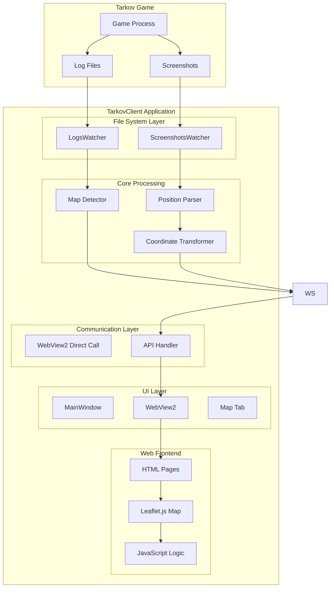

# 🏗️ TarkovClient 실시간 위치 공유 시스템 - 아키텍처 설계

## 📋 개요

본 문서는 TarkovClient에 통합될 실시간 위치 공유 시스템의 전체 아키텍처를 정의합니다. 기존 TarkovMonitor의 위치 파싱 로직과 tarkov-dev의 지도 시스템을 TarkovClient의 네이티브 환경으로 통합하는 설계를 다룹니다.

---

## 🎯 시스템 목표

### 핵심 목표
1. **독립성**: 외부 웹사이트 의존성 완전 제거
2. **실시간성**: 스크린샷 촬영 시 즉시 위치 업데이트
3. **정확성**: 게임 좌표와 지도 좌표 간 정밀 변환
4. **사용성**: 직관적이고 반응성 좋은 사용자 경험
5. **성능**: 게임 플레이에 영향을 주지 않는 최적화

### 비기능적 요구사항
- **응답시간**: 위치 업데이트 < 500ms
- **메모리**: 추가 사용량 < 100MB
- **CPU**: 백그라운드 사용률 < 5%
- **안정성**: 99.9% 가동률
- **호환성**: Windows 10/11, 다양한 해상도 지원

---

## 🏛️ 전체 시스템 아키텍처



---

## 🔧 컴포넌트 상세 설계

### 1. File System Layer (파일 시스템 계층)

#### ScreenshotsWatcher (확장)
**현재 상태**: ✅ 기본 구현 완료
```csharp
// 위치: src/FileSystem/ScreenshotsWatcher.cs
public static class ScreenshotsWatcher
{
    // 확장 필요 사항
    public static event EventHandler<PositionEventArgs> PositionDetected;
    
    private static void OnScreenshot(object sender, FileSystemEventArgs e)
    {
        // 기존: Server.SendFilename(filename);
        // 추가: 파일명에서 위치 정보 파싱
        var position = PositionParser.ParseFromFilename(filename);
        if (position != null)
        {
            PositionDetected?.Invoke(null, new PositionEventArgs(position));
        }
    }
}
```

#### LogsWatcher (신규)
**위치**: `src/FileSystem/LogsWatcher.cs` (신규 생성)
```csharp
public static class LogsWatcher
{
    public static event EventHandler<MapChangedEventArgs> MapChanged;
    
    private static void ParseMapChange(string logLine)
    {
        // TarkovMonitor의 맵 감지 로직 포팅
        var mapMatch = Regex.Match(logLine, @"scene preset path:maps\/(?<bundle>[^\.]+)\.bundle");
        if (mapMatch.Success)
        {
            string mapId = ConvertBundleToMapId(mapMatch.Groups["bundle"].Value);
            MapChanged?.Invoke(null, new MapChangedEventArgs(mapId));
        }
    }
}
```

### 2. Core Processing (핵심 처리 계층)

#### PositionParser (신규)
**위치**: `src/Core/PositionParser.cs`
```csharp
public static class PositionParser
{
    public static PlayerPosition ParseFromFilename(string filename)
    {
        // TarkovMonitor GameWatcher.cs:216-246 로직 포팅
        var match = Regex.Match(filename, 
            @"\d{4}-\d{2}-\d{2}\[\d{2}-\d{2}\]_?(?<position>.+) \(\d\)\.png");
        
        if (!match.Success) return null;
        
        var position = Regex.Match(match.Groups["position"].Value,
            @"(?<x>-?[\d]+\.[\d]{2}), (?<y>-?[\d]+\.[\d]{2}), (?<z>-?[\d]+\.[\d]{2})_?" +
            @"(?<rx>-?[\d.]{1}\.[\d]{1,5}), (?<ry>-?[\d.]{1}\.[\d]{1,5}), " +
            @"(?<rz>-?[\d.]{1}\.[\d]{1,5}), (?<rw>-?[\d.]{1}\.[\d]{1,5})");
        
        if (!position.Success) return null;
        
        return new PlayerPosition
        {
            X = float.Parse(position.Groups["x"].Value, CultureInfo.InvariantCulture),
            Y = float.Parse(position.Groups["y"].Value, CultureInfo.InvariantCulture),
            Z = float.Parse(position.Groups["z"].Value, CultureInfo.InvariantCulture),
            Rotation = QuaternionToYaw(
                float.Parse(position.Groups["rx"].Value, CultureInfo.InvariantCulture),
                float.Parse(position.Groups["ry"].Value, CultureInfo.InvariantCulture),
                float.Parse(position.Groups["rz"].Value, CultureInfo.InvariantCulture),
                float.Parse(position.Groups["rw"].Value, CultureInfo.InvariantCulture)
            )
        };
    }
    
    private static float QuaternionToYaw(float x, float y, float z, float w)
    {
        // TarkovMonitor GameWatcher.cs:248-277 로직
        float siny_cosp = 2.0f * (w * z + x * y);
        float cosy_cosp = 1.0f - 2.0f * (y * y + z * z);
        float yaw = (float)Math.Atan2(siny_cosp, cosy_cosp);
        return yaw * (180f / (float)Math.PI);
    }
}
```

#### MapDetector (신규)
**위치**: `src/Core/MapDetector.cs`
```csharp
public class MapDetector
{
    private static readonly Dictionary<string, string> MapBundles = new()
    {
        // TarkovMonitor GameWatcher.cs:134-148 맵핑
        { "city_preset", "TarkovStreets" },
        { "customs_preset", "bigmap" },
        { "factory_day_preset", "factory4_day" },
        // ... 전체 맵 목록
    };
    
    public static string ConvertBundleToMapId(string bundleName)
    {
        return MapBundles.ContainsKey(bundleName) ? MapBundles[bundleName] : null;
    }
    
    public static string DetectMapFromPosition(PlayerPosition position, string previousMap)
    {
        // 좌표 범위를 통한 맵 추정 로직 (2차 검증용)
        // 각 맵의 좌표 경계값으로 판단
        return EstimateMapFromCoordinates(position.X, position.Y, position.Z);
    }
}
```

#### CoordinateTransformer (신규)
**위치**: `src/Core/CoordinateTransformer.cs`
```csharp
public class CoordinateTransformer
{
    private readonly Dictionary<string, MapTransform> _mapTransforms;
    
    public MapPosition TransformToMapCoordinates(PlayerPosition gamePosition, string mapId)
    {
        // tarkov-dev의 좌표 변환 로직 포팅
        // map/index.js:47-71의 getCRS 함수 로직
        var transform = _mapTransforms[mapId];
        
        return new MapPosition
        {
            Lat = ApplyTransform(gamePosition.Z, transform.ScaleY, transform.MarginY),
            Lng = ApplyTransform(gamePosition.X, transform.ScaleX, transform.MarginX),
            Rotation = gamePosition.Rotation + transform.CoordinateRotation
        };
    }
    
    private double ApplyTransform(float coordinate, float scale, float margin)
    {
        return coordinate * scale + margin;
    }
}
```

### 3. Communication Layer (통신 계층)

#### WebView2 Direct Communication (신규)
**현재 상태**: 🆕 WebView2 네이티브 통신으로 대체
**위치**: `src/UI/MapViewController.cs` (신규 생성)

```csharp
// WebView2 직접 통신 구현
public class MapViewController
{
    private readonly WebView2 _webView;
    
    public MapViewController(WebView2 webView)
    {
        _webView = webView;
        InitializeJavaScriptBridge();
    }
    
    private void InitializeJavaScriptBridge()
    {
        _webView.CoreWebView2.WebMessageReceived += OnWebMessageReceived;
    }
    
    // C# → JavaScript: 위치 업데이트 (1ms 미만 지연시간)
    public async Task SendPlayerPosition(PlayerPosition position, string mapId)
    {
        var script = $@"
            if (window.tarkovMap && window.tarkovMap.updatePlayerPosition) {{
                window.tarkovMap.updatePlayerPosition({{
                    mapId: '{mapId}',
                    x: {position.X},
                    y: {position.Y},
                    z: {position.Z},
                    rotation: {position.Rotation},
                    timestamp: {DateTimeOffset.UtcNow.ToUnixTimeMilliseconds()}
                }});
            }}
        ";
        
        await _webView.CoreWebView2.ExecuteScriptAsync(script);
    }
    
    // C# → JavaScript: 맵 변경 알림
    public async Task SendMapChanged(string newMapId)
    {
        var script = $@"
            if (window.tarkovMap && window.tarkovMap.switchMap) {{
                window.tarkovMap.switchMap('{newMapId}');
            }}
        ";
        
        await _webView.CoreWebView2.ExecuteScriptAsync(script);
    }
    
    // JavaScript → C#: 메시지 수신
    private void OnWebMessageReceived(object sender, CoreWebView2WebMessageReceivedEventArgs e)
    {
        var messageJson = e.TryGetWebMessageAsString();
        // 설정 변경 등 JavaScript에서 오는 메시지 처리
        ProcessWebViewMessage(messageJson);
    }
}
```

### 4. UI Layer (사용자 인터페이스 계층)

#### MainWindow (확장)
**현재 상태**: ✅ 탭 시스템 구현 완료
**위치**: `src/UI/MainWindow.xaml.cs`

```csharp
// 지도 탭 생성 메서드 추가
private async Task CreateMapTab()
{
    var mapTab = new TabItem
    {
        Header = "지도 (Map)",
        Background = new SolidColorBrush(Color.FromRgb(42, 42, 42)),
        Foreground = Brushes.White
    };
    
    var webView = new WebView2();
    mapTab.Content = webView;
    
    // 가상 호스트 매핑으로 로컬 HTML 로드
    await InitializeMapWebView(webView, mapTab);
    
    TabContainer.Items.Add(mapTab);
    TabContainer.SelectedItem = mapTab;
}

private async Task InitializeMapWebView(WebView2 webView, TabItem tabItem)
{
    // 기존 InitializeQuestWebView 패턴 활용
    var webView2Environment = await CoreWebView2Environment.CreateAsync(...);
    await webView.EnsureCoreWebView2Async(webView2Environment);
    
    // 맵 HTML 파일 로드
    webView.Source = new Uri("https://tarkov.local/map.html");
}
```

### 5. Web Frontend (웹 프론트엔드)

#### HTML Structure
**위치**: `src/Webs/components/Map/`

```
Map/
├── Map.html          # 메인 지도 페이지
├── Map.css           # 스타일시트
├── Map.js            # 지도 로직
├── leaflet/          # Leaflet.js 라이브러리
│   ├── leaflet.js
│   └── leaflet.css
└── data/             # 맵 데이터
    ├── maps.json     # 맵 메타데이터
    └── transforms.json # 좌표 변환 설정
```

#### JavaScript Architecture
```javascript
// Map.js 구조 - WebView2 Direct Communication
class TarkovMap {
    constructor() {
        this.leafletMap = null;
        this.currentMap = null;
        this.playerMarker = null;
    }
    
    initialize() {
        this.setupLeaflet();
        this.exposeToWindow(); // WebView2 통신을 위해 window 객체에 노출
        this.bindEvents();
    }
    
    exposeToWindow() {
        // C#에서 호출할 수 있도록 window 객체에 메서드 노출
        window.tarkovMap = {
            updatePlayerPosition: this.updatePlayerPosition.bind(this),
            switchMap: this.switchMap.bind(this),
            getMapSettings: this.getMapSettings.bind(this)
        };
    }
    
    updatePlayerPosition(data) {
        // C#에서 직접 호출되는 메서드
        this.updatePlayerMarker(data.x, data.y, data.z, data.rotation);
    }
    
    switchMap(mapId) {
        // C#에서 직접 호출되는 맵 변경 메서드
        this.loadMapTiles(mapId);
        this.currentMap = mapId;
    }
    
    // JavaScript → C#으로 메시지 전송
    sendMessageToCSharp(message) {
        if (window.chrome && window.chrome.webview) {
            window.chrome.webview.postMessage(JSON.stringify(message));
        }
    }
}
```

---

## 📊 데이터 모델

### Core Models

#### PlayerPosition
```csharp
public class PlayerPosition
{
    public float X { get; set; }
    public float Y { get; set; }
    public float Z { get; set; }
    public float Rotation { get; set; }
    public DateTime Timestamp { get; set; }
}
```

#### MapPosition
```csharp
public class MapPosition
{
    public double Lat { get; set; }
    public double Lng { get; set; }
    public float Rotation { get; set; }
}
```

#### MapTransform
```csharp
public class MapTransform
{
    public float ScaleX { get; set; }
    public float ScaleY { get; set; }
    public float MarginX { get; set; }
    public float MarginY { get; set; }
    public int CoordinateRotation { get; set; }
}
```

#### GameMap
```csharp
public class GameMap
{
    public string Id { get; set; }
    public string Name { get; set; }
    public string NormalizedName { get; set; }
    public MapTransform Transform { get; set; }
    public string ImagePath { get; set; }
    public int MinZoom { get; set; }
    public int MaxZoom { get; set; }
}
```

---

## 🔄 데이터 흐름

### 1. 위치 업데이트 플로우
```
[Screenshot] → [ScreenshotsWatcher] → [PositionParser] → [CoordinateTransformer] 
             ↓
[Direct Call] → [JavaScript] → [Leaflet.js] → [Map Display]
```

### 2. 맵 변경 플로우
```
[Game Log] → [LogsWatcher] → [MapDetector] → [Direct Call] → [JavaScript] → [Map Switch]
```

### 3. 설정 동기화 플로우
```
[Settings UI] → [C# Settings] → [Direct Call] → [JavaScript Settings] → [Map Behavior]
```

---

## 🔌 API 인터페이스

### WebView2 Direct Communication

#### Client → Server (JavaScript → C#)
```json
{
  "type": "mapSwitchRequest",
  "data": { "mapId": "customs" }
}

{
  "type": "settingsUpdate", 
  "data": { "autoMapSwitch": true, "showRotation": true }
}
```

#### Server → Client (C# → JavaScript)
```json
{
  "type": "playerPosition",
  "data": {
    "mapId": "customs",
    "position": { "x": 100.5, "y": 200.3, "z": 10.1 },
    "rotation": 45.0,
    "timestamp": 1693190400000
  }
}

{
  "type": "mapChanged",
  "data": { "mapId": "woods", "autoSwitch": true }
}
```

---

## ⚡ 성능 최적화 전략

### 1. 메모리 관리
- **객체 풀링**: Position, MapPosition 객체 재사용
- **가비지 컬렉션**: 불필요한 할당 최소화
- **이벤트 해제**: 적절한 이벤트 핸들러 정리

### 2. CPU 최적화  
- **비동기 처리**: 파일 파싱 및 좌표 변환 비동기화
- **캐싱**: 자주 사용되는 변환 결과 캐시
- **배치 처리**: 여러 위치 업데이트 일괄 처리

### 3. 네트워크 최적화
- **메시지 압축**: JSON 최소화
- **직접 호출**: 네트워크 계층 없이 즉시 실행
- **큐잉**: 대량 메시지 순서 보장

---

## 🛡️ 안정성 및 오류 처리

### 에러 처리 전략
1. **방어적 프로그래밍**: 모든 입력 검증
2. **우아한 실패**: 부분 실패 시 기능 유지
3. **로깅**: 상세한 오류 로그 및 추적
4. **복구**: 자동 재연결 및 상태 복구

### 예외 상황 처리
- 스크린샷 파싱 실패 → 이전 위치 유지
- 맵 감지 실패 → 수동 맵 선택 옵션
- WebView2 초기화 실패 → 재시도 및 fallback UI
- Leaflet 초기화 실패 → 기본 맵 표시

---

## 🔮 확장성 고려사항

### 향후 확장 가능 기능
1. **다중 플레이어**: 파티원 위치 공유
2. **경로 기록**: 이동 경로 추적 및 표시
3. **마커 시스템**: 사용자 정의 마커 및 메모
4. **통계**: 맵별 플레이 시간 및 분석
5. **동기화**: 클라우드 설정 및 데이터 동기화

### 아키텍처 확장점
- **플러그인 시스템**: 추가 기능 모듈화
- **데이터베이스**: 영구 데이터 저장 지원
- **REST API**: 외부 도구 연동 인터페이스
- **실시간 협업**: 멀티유저 기능 지원

---

*최종 업데이트: 2025-08-27*  
*다음 문서: implementation-plan.md*